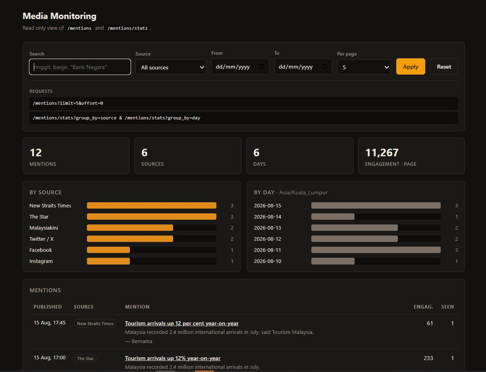

# Media Monitoring — Masukkan Data, Cari, Hitung

Endpoint untuk memasukkan data massal, mencari, dan menghitung, di atas data
yang sengaja dikotori. Node 20 + TypeScript + Fastify + PostgreSQL. SQL ditulis
tangan, tanpa ORM.

**15 record mentah di `seed_mentions.json` jadi 12 berita.** Selisih itulah
inti soalnya.

> Versi Inggris: [README.md](README.md) — itu yang dibaca penilai.
> Halaman ini terjemahannya.

---

## Yang dibutuhkan

Node **20.11+** · PostgreSQL **12+** (butuh kolom `GENERATED` dan
`websearch_to_tsquery`). Diuji di Node 20.11 dan PostgreSQL 17.2.
Tanpa Docker, dan tidak perlu proses build untuk menjalankannya.

---

## Cara menjalankan

```bash
git clone <alamat-repo>
cd <folder>
npm install

createdb media_monitoring

cp .env.example .env        # Windows: copy .env.example .env
# lalu sesuaikan DATABASE_URL di .env kalau PostgreSQL Anda berbeda

npm run db:setup            # membuat tabel dari db/schema.sql
npm run dev                 # server di http://127.0.0.1:3000
```

`npm run db:setup` mencetak:

```
Database siap.
Tabel yang ada: mentions, sources
```

**Masukkan data seed** — lewat skrip jalan pintas, atau lewat endpoint-nya:

```bash
npm run ingest

# atau
curl -X POST http://127.0.0.1:3000/internal/mentions/bulk \
  -H "Content-Type: application/json" --data-binary @seed_mentions.json
```

```
  Diterima         : 15 record
  Baris baru       : 12
  Duplikat digabung: 3
  Bentuknya rusak  : 0
```

**Jalankan kedua kali: `Baris baru: 0`, dan jumlah barisnya tidak bergerak.**
Keduanya memanggil `ingestMentions()` yang sama, jadi tidak ada jalur kode kedua.

**Lalu buka <http://127.0.0.1:3000>** — halaman dashboard baca-saja yang hanya
memanggil endpoint milik layanan ini sendiri, dan menampilkan alamat permintaan
yang dipakainya supaya bisa langsung disalin ke `curl`. Opsional menurut brief;
daftar endpoint dalam bentuk JSON ada di `/api`.



Kolom `Seen` itu `times_seen`, jadi duplikat yang sudah digabung kelihatan
langsung di layar: artikel ringgit menunjukkan 3, artikel GDP 2.

```bash
npm test          # 98 tes
npm run typecheck
```

> `npm test` mengosongkan tabel. Jalankan `npm run ingest` lagi setelahnya, atau
> arahkan `TEST_DATABASE_URL` ke database terpisah (lihat `.env.example`).

---

## Daftar endpoint

| Endpoint | Keterangan |
|---|---|
| `POST /internal/mentions/bulk` | Array JSON telanjang, persis bentuk `seed_mentions.json`. Idempotent. Mengembalikan **200**, bukan 201 — kiriman kedua tidak membuat apa pun. Melaporkan `inserted` / `merged` / `invalid` plus peringatan per record. |
| `GET /mentions` | `q`, `source`, `from`, `to`, `limit` (1–100, bawaan 20), `offset` |
| `GET /mentions/stats?group_by=source` | jumlah per koran |
| `GET /mentions/stats?group_by=day` | jumlah per hari, menurut `Asia/Kuala_Lumpur` |

`source` menerima slug (`thestar`) **atau** nama biasa (`The Star`) — dilewatkan
penyeragam yang sama dengan saat data masuk. `to=2026-08-11` mencakup **seluruh**
tanggal 11 Agustus. Parameter yang salah mengembalikan **400** berisi semua
masalahnya sekaligus.

`q`, `source`, `from`, `to` dibaca dan diubah jadi SQL di satu modul bersama
([`src/filters.ts`](src/filters.ts)) yang dipakai ketiga endpoint, jadi grafik
dan daftarnya mustahil berbeda. Diperiksa: untuk tujuh kombinasi saringan,
`/mentions`, `stats=source`, dan `stats=day` selalu memberi total yang sama.

**Urutan tampilan** — dikembalikan di setiap respon sebagai `sort`:

```
ORDER BY published_at DESC NULLS LAST, id DESC
```

`NULLS LAST` ditulis eksplisit karena pada urutan `DESC` PostgreSQL menganggap
`NULL` sebagai nilai terbesar. `id DESC` adalah pemecah seri dan itu bagian
terpentingnya: beberapa berita bisa punya `published_at` sama persis, dan saat
seri PostgreSQL boleh mengembalikan urutan berbeda tiap permintaan — sehingga
halaman 2 mengulang baris halaman 1 sementara baris lain tidak pernah muncul.
Ada tesnya: menyusuri tiga halaman dan memastikan 12 id unik tanpa celah.

---

## Bentuk tabel, dan alasannya

Satu file yang ikut di-commit: [`db/schema.sql`](db/schema.sql). Tanpa ORM,
tanpa GUI.

```sql
sources   id · slug (UNIQUE) · display_name · platform (CHECK) · created_at

mentions  id · source_id → sources(id) · external_id · url · canonical_url
          title · content_raw · content_clean · author
          published_at (TIMESTAMPTZ, boleh kosong) · published_at_raw
          engagement (INTEGER) · dedupe_key (UNIQUE)
          times_seen · first_seen_at · updated_at · search_tsv (GENERATED)
```

**`sources` dipisah jadi tabel sendiri** karena data feed menulis satu koran
dengan bermacam ejaan — `"The Star"` / `"thestar"`, `"malaysiakini "` berspasi,
`"twitter"` / `"TWITTER"`. Menghitung teks mentahnya akan melaporkan satu koran
sebagai tiga di `group_by=source`. Namanya diterjemahkan jadi slug tetap sekali
saja, saat data masuk.

**Isi berita disimpan dua kali.** Membersihkan itu menghapus informasi. Dengan
menyimpan `content_raw`, aturan pembersihan yang salah — atau aturan duplikat
yang salah — bisa diperbaiki dengan menghitung ulang kolom turunannya lewat satu
migration, tanpa minta data dikirim ulang.

**`published_at` boleh kosong dan itu disengaja.** Data feed memang mengirim
berita tanpa tanggal (`mkn-1201`). Mengarang tanggal akan merusak grafik harian
diam-diam, dan nilai salah yang tampak meyakinkan lebih buruk daripada
kekosongan yang diakui. `published_at_raw` menyimpan teks aslinya supaya laporan
"tanggalnya salah" bisa ditelusuri.

**`TIMESTAMPTZ`, bukan `TIMESTAMP`** — data datang dari tiga kebiasaan zona
waktu (`Z`, `+08:00`, dan tanpa keterangan), jadi pengurutannya harus dijamin
database.

**`UNIQUE (dedupe_key)` inilah yang membuat pemasukan data idempotent**, dan
penjaganya database bukan aplikasi: pengecekan "SELECT dulu, INSERT kemudian"
punya celah — dua permintaan bersamaan sama-sama melihat "belum ada" lalu
keduanya menyimpan. Index unik tidak bisa dikelabui begitu.

**`search_tsv` adalah kolom `GENERATED`**, jadi PostgreSQL memeliharanya setiap
kali baris berubah dan index pencarian mustahil melenceng. Kamusnya `simple`,
bukan `english`: datanya campur Inggris–Melayu, dan kamus Inggris akan
memotong-motong kata Melayu sambil tampak seolah memahaminya.

Index dibuat mengikuti permintaan yang benar-benar dilayani: persis urutan
tampilan resmi, urutan yang sama disaring per koran, index sebagian untuk
`canonical_url`, dan GIN untuk `search_tsv`.

---

## Aturan duplikat, dan alasannya

```
dedupe_key = sha256( slug_koran + "|" + sidik_jari(judul atau isi) )
```

`sidik_jari()` mengecilkan huruf, membuang tanda baca dan emoji, merapatkan
spasi, mengambil 300 huruf pertama. Ditegakkan `UNIQUE (dedupe_key)` +
`ON CONFLICT DO UPDATE`.

Data seed memuat empat tingkat kemiripan. Aturannya berhenti setelah tingkat 3:

| | Contoh | Berita yang sama? |
|---|---|---|
| 1. ID dan koran sama persis | `str-99120` dua kali | Ya |
| 2. URL sama, ID dan nama beda | `str-99120` vs `nst-40021` | Ya |
| 3. Isi sama, koran sama, URL baru | `mkn-1201` vs `mkn-1202` | Ya |
| 4. Berita sama, **koran berbeda** | The Star vs NST soal turis | **Tidak — dua berita** |

**Tingkat 4 itu garisnya, dan ini keputusan produk.** Alat pemantau media ada
untuk memberi tahu analis PR berapa koran yang mengangkat beritanya; menggabung
antar koran menghapus metrik paling bernilai di produk itu. Memasukkan
`slug_koran` ke dalam hash membuat penggabungan itu mustahil secara struktur.
Prinsipnya: duplikat yang lolos itu cuma berisik, tapi data yang hilang itu
bohong.

**Bukan `external_id`** — karena bohong. `nst-40021` punya ID berlabel NST
padahal URL-nya `thestar.com.my`. **Bukan URL** — `mkn-1201` dan `mkn-1202`
adalah satu artikel di dua URL; URL itu alamat, bukan identitas. `canonical_url`
tetap disimpan dan diberi index untuk pemeriksa kedua yang belum saya kerjakan
(lihat bagian akhir).

Judul dipakai lebih dulu karena judul adalah ringkasan paling stabil dari sebuah
artikel. Postingan sosmed tidak punya judul, jadi isinya yang jadi judul; record
yang tidak punya keduanya jatuh ke URL lalu ke ID penyedia, supaya record tanpa
teks tidak semuanya bertabrakan di hash teks kosong.

**Duplikat digabung, bukan dibuang:**

| Kolom | Aturan | Kenapa |
|---|---|---|
| `engagement` | tertinggi | Like hanya bertambah, jadi terbesar = pengukuran terbaru (412 → 415 → 1204) |
| `published_at` | paling awal | Artikel punya satu waktu terbit; selisih menit itu jeda robot pengumpul |
| `published_at_raw` | yang sepadan dengan `published_at` terpilih | Kalau tidak, kolom audit ini menyesatkan |
| `author`, `title`, `url` | pertahankan yang ada, isi kalau kosong | `str-99120` punya penulis; salinannya `null` |
| isi berita | yang lebih panjang | Biasanya lebih lengkap |
| `times_seen` | +1 | Mendeteksi robot bermasalah, sekaligus penanda baru-atau-gabungan |

`GREATEST`/`LEAST` di PostgreSQL mengabaikan `NULL`, persis perilaku "ambil dari
salinan yang punya nilai".

---

## Asumsi yang saya ambil

1. **Tanggal tanpa zona waktu dibaca sebagai UTC.** Buktinya di data:
   `nst-40021` `"2026-08-10 08:20:00"` adalah artikel yang sama dengan
   `str-99120` `"2026-08-10T08:15:00Z"`. Dibaca UTC jaraknya 5 menit — wajar
   untuk penarikan ulang. Dibaca UTC+8 salinannya terbit 8 jam sebelum aslinya,
   yang mustahil.
2. **Tanggal tanpa jam dibaca sebagai tanggal lokal Malaysia**, disimpan sebagai
   tengah malam UTC+8. Tanggal tanpa jam itu nilai untuk manusia, ditulis
   menurut kalender penerbitnya.
3. **`"11/08/2026"` adalah 11 Agustus.** Penerbit Malaysia menulis hari dulu,
   dan seluruh data berkumpul di 10–15 Agustus. Kalau salah satu angka di atas
   12, ambiguitasnya hilang sendiri dan mengalahkan kebiasaan penulisan.
4. **Hari dihitung menurut `Asia/Kuala_Lumpur`**, ditulis eksplisit di dalam
   perintah SQL, bukan mengandalkan pengaturan server. Berita GDP tersimpan
   sebagai `2026-08-10 16:00 UTC` — 10 Agustus kalau dihitung UTC, **11 Agustus**
   kalau waktu Malaysia. Yang benar 11 Agustus: nilai asli di data feed memang
   `"11/08/2026"`, dan pemakainya analis yang berpikir dalam hari lokal.
5. **Berita tanpa tanggal tidak ikut saat saringan tanggal aktif** — kita tidak
   bisa membuktikan ia ada di dalam rentangnya. Alasannya dikembalikan di respon,
   bukan dibiarkan jadi misteri. Di `group_by=day` ia justru dapat ember sendiri,
   karena grafik yang membuang baris diam-diam adalah grafik yang berbohong.
6. **Nama host URL yang menentukan koran**, lebih dipercaya daripada kolom
   `source` yang cuma teks bebas. Keterbatasan yang diketahui: link dari situs
   pengumpul berita akan terbaca sebagai si pengumpul.
7. **`title: ""` sama artinya dengan `title: null`** — data feed memakai `null`
   untuk tweet dan `""` untuk postingan Facebook.
8. **Nilai yang gagal dibaca jadi `NULL` ditambah peringatan**, bukan tebakan
   yang meyakinkan.

---

## Pertukaran yang saya terima sadar

1. **Kamus `simple` berarti bentuk kata tidak dicocokkan** — `flood` tidak
   menemukan "Flash floods". Itu harga dari kamus yang aman untuk teks campur
   Inggris–Melayu. Ditulis sebagai tes supaya keterbatasannya tercatat.
2. **Paginasi `LIMIT`/`OFFSET`.** Totalnya tepat dan benar karena urutannya
   sudah pasti, tapi melambat di halaman yang jauh. Paginasi berbasis kunci akan
   memperbaikinya dengan harga kehilangan "langsung ke halaman N".
3. **Satu `INSERT` per berita.** Jelas, dan cukup untuk 15 record; untuk 10.000
   record akan terasa lambat.
4. **Totalnya memakai perintah SQL kedua.** `count(*) OVER ()` bisa
   menyatukannya, tapi kalau `offset` melewati baris terakhir tidak ada baris
   yang kembali dan totalnya diam-diam terbaca 0. Ada tesnya.
5. **Satu aturan duplikat, bukan dua** — pemeriksa kedua berbasis URL sengaja
   ditahan supaya aturannya tetap tunggal dan mudah dijelaskan.
6. **`group_by=day` tidak memunculkan hari berjumlah nol.** Mengisi hari kosong
   berarti API memutuskan sendiri rentang tanggalnya, padahal itu wewenang
   pemanggilnya.
7. **Skema sebagai satu file SQL, bukan migration bernomor.** Tepat untuk satu
   versi skema; tidak berskala untuk evolusi skema sungguhan.
8. **Peringatan dikembalikan seluruhnya**, dan pemasukan data satu transaksi.
   Keduanya benar pada ukuran ini, dan perlu dibatasi/dipecah pada skala besar.

---

## Tes

```bash
npm test        # 98 tes, 7 berkas
```

Brief meminta beberapa tes yang berarti atas bagian paling berisiko. Tes ini
mengarah ke tempat di mana jawaban yang salah sekaligus **tidak kelihatan** —
tidak satu pun akan melempar error kalau perilakunya berubah:

- **`dedupe.test.ts`** — diuji terhadap `seed_mentions.json` sendiri: 15 record
  → 12 berita, tiga kelompok duplikat menyatu, dan dua koran yang mengangkat
  berita pariwisata yang sama tetap terpisah.
- **`ingest.test.ts`** — idempotency terhadap PostgreSQL sungguhan: kiriman
  ke-1, ke-2, dan ke-5 semuanya menyisakan 12 baris, plus setiap aturan
  penggabungan.
- **`search.test.ts`** — tiga halaman berturut-turut menghasilkan 12 id unik
  tanpa celah (gagal kalau pemecah seri dihapus); `to=<tanggal>` mencakup
  seluruh hari; baris tanpa tanggal keluar saat disaring tanggal.
- **`stats.test.ts`** — ember hari memakai waktu Malaysia bukan UTC; baris tanpa
  tanggal dihitung di ember sendiri, bukan dibuang.
- **`dates.test.ts`** — keenam bentuk tanggal dan `11/08/2026` yang ambigu.
- **`text.test.ts`** — `<script>alert(1)</script>` tidak bisa sampai ke browser,
  termasuk bentuk yang bersembunyi di balik entity HTML.
- **`sources.test.ts`** — jalur pencocokan nama koran, yang tidak pernah
  berjalan di data seed karena semua record punya host yang dikenali.

Tes database dijalankan terhadap PostgreSQL sungguhan karena yang diuji justru
jaminan dari database itu sendiri. `ingest.test.ts` membungkus semuanya dalam
transaksi yang selalu dibatalkan.

---

## Waktu yang dipakai

Sekitar **3 jam**, dalam **dua sesi di dua hari** (17–18 Agustus 2026).

Sesi pertama untuk membaca brief, menyusuri `seed_mentions.json` record per
record, lalu menetapkan skema dan aturan duplikat. Sesi kedua untuk ketiga
endpoint, tesnya, dan README ini.

Satu jalan memutar: versi pertama saya bangun di atas SQLite demi kemudahan
pemasangan, lalu pindah ke PostgreSQL setelah jelas bahwa tiga hal yang
dibutuhkan soal ini — `TIMESTAMPTZ` untuk tiga kebiasaan zona waktu, kolom
pencarian ber-index yang dikelola database sendiri, dan aturan yang ditegakkan
database — persis yang tidak diberikan SQLite. Riwayat commit memuat perubahan
pendirian itu.


